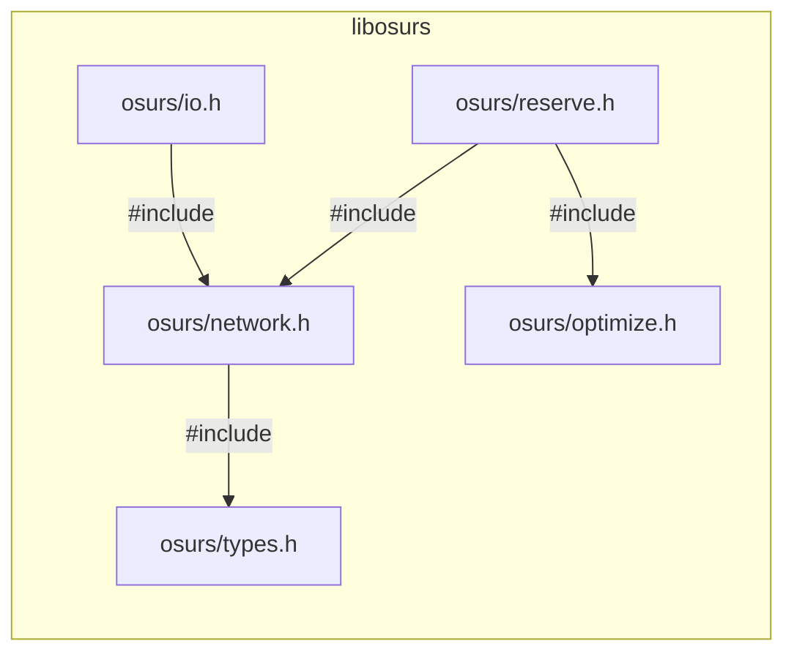
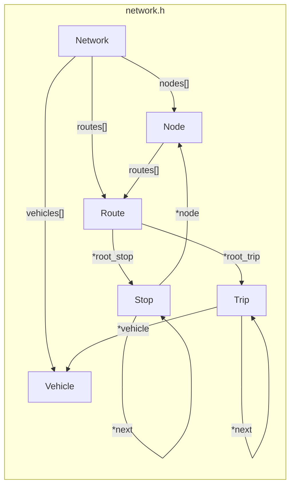
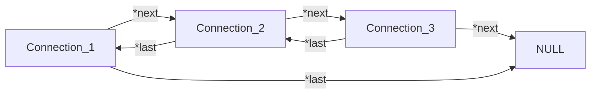
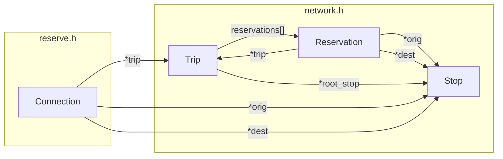
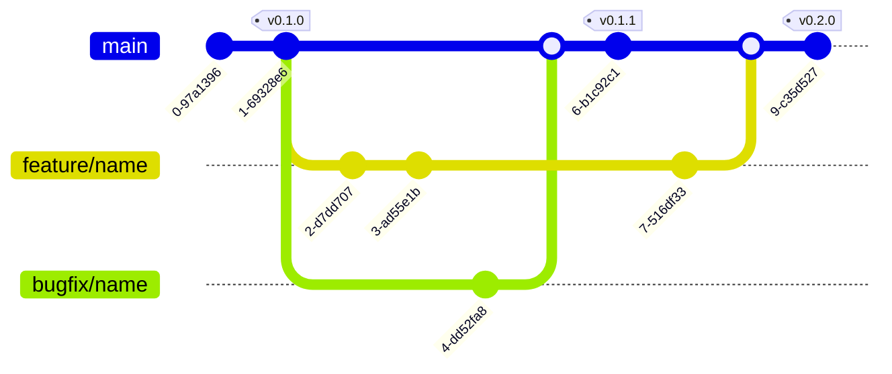

# osurs

Optimization of space utilization in reservation systems. An algorithm for optimal distribution of reservations along a trip among available seats.

The **osurs** library contains the following modules with corresponding headers:

- **io:** Input and output of networks and its strutures.
- **network:** Network for reservation optmization.
- **optimize:** Optimizing space utilization in reservation systems.
- **reserve:** Connection routing, checking seat availability and reservation.
- **types:** Data types of osurs.

**Interdependencies**



**Note:** The core functionality of **osurs** is in the `optimize.h` module. There are already powerful routing algorithms for public transport, so the algorithm included here is minimal and only serves to book reservations on already known/found connections to the right segments of the trips (without transfers).

## Network structure

The network consists of nodes where vehicles stop and passengers can get on and off. A route stores the order in which the nodes are approached by a vehicle in a chain of stops. Each stop contains information about which stop is next and how long it takes to reach it. On routes, trips indicate the departure times at which a vehicle leaves from the route's root stop. Vehicle information such as capacity and reservations are stored at the trip level.

All objects of the network are located on the heap and are directly or indirectly linked to the network structure. If the memory of the network is released (`delete_network()`) all associated structures of the network are also cleared.



Queried connections are not stored on the network and must be released individually to prevent a memory leak (`delete_connection()`). If more than one connection is possible between to nodes on the network, a connection chain is created. In a connection chain, the `.last` property of the connection structure points to the last connection or `NULL` if it is the root of the chain. Identically, the `.next` property points to the next connection or to `NULL` if it is the end of the chain.



When a reservation is made, it is stored as a reservation struct on the network with a relation to the corresponding trip. The reservation exists on the heap until the entire network is released.



## Development

### Trunk-based development workflow

The [trunk-based development workflow](https://trunkbaseddevelopment.com) uses one `main` branch to record the history of the project. In addition to the mainline, short-lived feature or bugfix branches are used to develop new features or fix bugs.



This library uses [Semantic Versioning](https://semver.org/spec/v2.0.0.html). Once `main` has aquired enough features for a release, set the new version number in the [`CMakeLists.txt`](CMakeLists.txt) and [`CHANGELOG.md`](CHANGELOG.md). Commit and push to `main` and publish a release on [GitHub](https://github.com/maptic/osurs/releases) with the version number as tag.

### Style guide

Maybe use the [Linux kernel coding style](https://www.kernel.org/doc/html/v4.10/process/coding-style.html) guide?

### Testsing

Always write a unit test for new features using googletest and check for memory leaks before merging a feature into main:

```sh
valgrind -s --leak-check=full ./main
```

### Setup dependencies

- cmake
- doxygen, graphviz
- googletest (installed via cmake)
- valgrind
- xml2

- **Ubuntu**

```sh
apt install cmake doxygen graphviz valgrind
```

- **macOS:**

```sh
brew install cmake doxygen graphviz
brew tap LouisBrunner/valgrind
brew install --HEAD LouisBrunner/valgrind/valgrind
```

## To Do

- **Optimierung der Reservationen**:

  - Die Reservationen speichern keine Sitzplatzzuweisungen? --> Wird immer neu berechnet?
  - Reservationen von trips hohlen (Trip ist ein Fahrzeug welches eine Route abfährt, also Annahme Kapazität konstant?)
  - Abbilden von structs in Tobis Magic BitMuster
  - Rotieren und Kaste-Optimere
  - Struct `Vechicle` oder `Container` returnen mit optmiererer Sitzplatz verteilung
  - Container: Kapazität, Sitzplätze und Reservationen, eventuell müssen wir hier IDs einführen. Also Sitz poatz und Reservaitons IDs, ... ist aber Zukunftsmusik.

- **Einfache API bereitstellen**:

  - Ich würde einen Python Wrapper vorschlagen, alle Berechnungen passieren in C, python kennt nur den Pointer zu dem network struct und ruft die C funktionen auf den struct pointer auf.
  - Funktionalität:
    - Network Class mit methoden:
      - net.add_node(name, coords)
      - net.add_route(node_list, trip_list, vehicle_list)
      - connection oder None = net.find_route(nodeA, nodeB, departure, seats) --> gleich mehrere Plätze prüfen, e.g. Familien usw.
      - net.reserve_connection(connection)
      - container/vehicle = net.optimize_utilization(trip): Optimiert platz reservationen (THE MAGIC IS HERE)
      - net.export(): Vorschlag --> Wir exportieren das netzwerk als MATSim XML public transport network, dann kann es auch für simulationen verwendet werden.
      - net.import(): Importiert MATSim XML public transport network, vorteil: Bereits bestehende Netzwerke können importiert werden.
      - Visualiserungen: Netzwerk plotten, auslastung pro route, Auslastung pro Fahrzeug/Trip plotten.

## References

- [Calling Doxygen from cmake](https://p5r.uk/blog/2014/cmake-doxygen.html)
- [Canonical Project Structure](https://www.open-std.org/jtc1/sc22/wg21/docs/papers/2018/p1204r0.html)
- [Creating and running tests with CTest](https://coderefinery.github.io/cmake-workshop/testing/)
- [GoogleTest: Building with CMake](https://google.github.io/googletest/quickstart-cmake.html)
- [Import C headers in CPP](https://stackoverflow.com/questions/23646595/)
- [Integrating Google Test Into CMake Projects](https://matgomes.com/integrate-google-test-into-cmake/)
- [Keep a changelog](https://keepachangelog.com/en/1.0.0/)
- [Mermaid Cheat Sheet](https://jojozhuang.github.io/tutorial/mermaid-cheat-sheet/)
- [modern-cmake/examples/extended-project](https://gitlab.com/CLIUtils/modern-cmake/-/tree/master/examples/extended-project)
