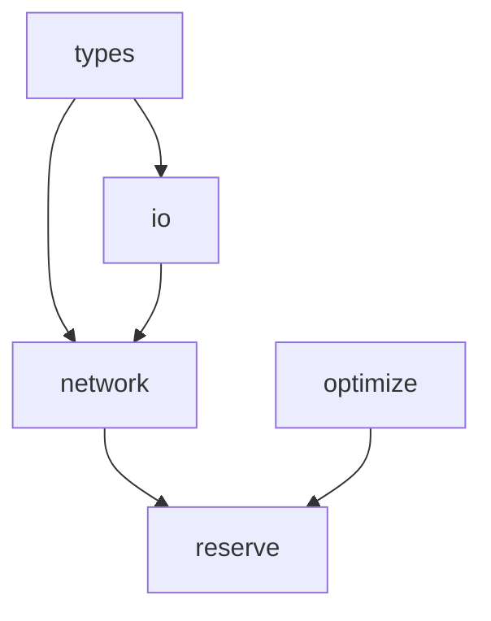
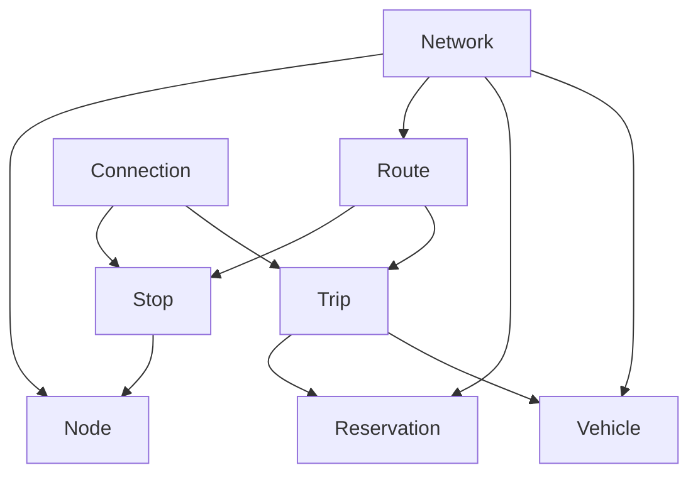

# osurs

Optimization of space utilization in reservation systems, an algorithm for optimal distribution of reservations along a trip among available seats.

The osurs library contains the following modules with corresponding headers:

- `io.h`: Importing and exporting networks (network, vehicles and reservations).
- `network.h`: Structures to represent a network of a reservation system.
- `optimize.h`: Optimizing space utilization in reservation systems.
- `reserve.h`: Simple routing alogrithm without transfers for checking seat availability in connections.
- `types.h`: Data types of osurs.

Interdependencies:



Note: The core functionality of **osurs** is in the **optimize** package.
There are already powerful routing algorithms for public transport,
so the algorithm included here is minimal and only serves to book
reservations on already known/found connections to the right segments
of the trips (without transfers).

## Network structure

The network consists of nodes where vehicles stop and passengers can get on and off. A route stores the order in which the nodes are approached by a vehicle in a chain of stops. Each stop contains information about which stop is next and how long it takes to reach it. On routes, trips indicate the departure times at which a vehicle leaves from the route's root stop. Vehicle information such as capacity and reservations are stored at the trip level.



## Development

**Style guide:**

Maybe use the [Linux kernel coding style](https://www.kernel.org/doc/html/v4.10/process/coding-style.html) guide?

**Dependencies:**

- cmake
- doxygen, graphviz
- googletest (installed via cmake)
- valgrind
- xml2

**Tests:**

Always write a unit test for new features using googletest and check for memory leaks before merging a feature into main:

```sh
valgrind -s --leak-check=full ./main
```

## To Do

- **Optimierung der Reservationen**:

  - Die Reservationen speichern keine Sitzplatzzuweisungen? --> Wird immer neu berechnet?
  - Reservationen von trips hohlen (Trip ist ein Fahrzeug welches eine Route abfährt, also Annahme Kapazität konstant?)
  - Abbilden von structs in Tobis Magic BitMuster
  - Rotieren und Kaste-Optimere
  - Struct `Vechicle` oder `Container` returnen mit optmiererer Sitzplatz verteilung
  - Container: Kapazität, Sitzplätze und Reservationen, eventuell müssen wir hier IDs einführen. Also Sitz poatz und Reservaitons IDs, ... ist aber Zukunftsmusik.

- **Einfache API bereitstellen**:

  - Ich würde einen Python Wrapper vorschlagen, alle Berechnungen passieren in C, python kennt nur den Pointer zu dem network struct und ruft die C funktionen auf den struct pointer auf.
  - Funktionalität:
    - Network Class mit methoden:
      - net.add_node(name, coords)
      - net.add_route(node_list, trip_list, vehicle_list)
      - connection oder None = net.find_route(nodeA, nodeB, departure, seats) --> gleich mehrere Plätze prüfen, e.g. Familien usw.
      - net.reserve_connection(connection)
      - container/vehicle = net.optimize_utilization(trip): Optimiert platz reservationen (THE MAGIC IS HERE)
      - net.export(): Vorschlag --> Wir exportieren das netzwerk als MATSim XML public transport network, dann kann es auch für simulationen verwendet werden.
      - net.import(): Importiert MATSim XML public transport network, vorteil: Bereits bestehende Netzwerke können importiert werden.
      - Visualiserungen: Netzwerk plotten, auslastung pro route, Auslastung pro Fahrzeug/Trip plotten.

## References

- [Canonical Project Structure](https://www.open-std.org/jtc1/sc22/wg21/docs/papers/2018/p1204r0.html)
- [Creating and running tests with CTest](https://coderefinery.github.io/cmake-workshop/testing/)
- [GoogleTest: Building with CMake](https://google.github.io/googletest/quickstart-cmake.html)
- [Import C headers in CPP](https://stackoverflow.com/questions/23646595/)
- [Integrating Google Test Into CMake Projects](https://matgomes.com/integrate-google-test-into-cmake/)
- [modern-cmake/examples/extended-project](https://gitlab.com/CLIUtils/modern-cmake/-/tree/master/examples/extended-project)
