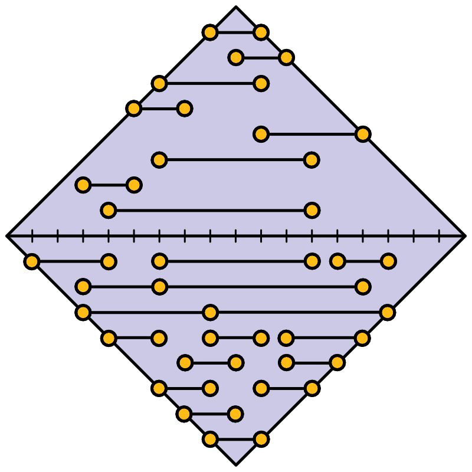
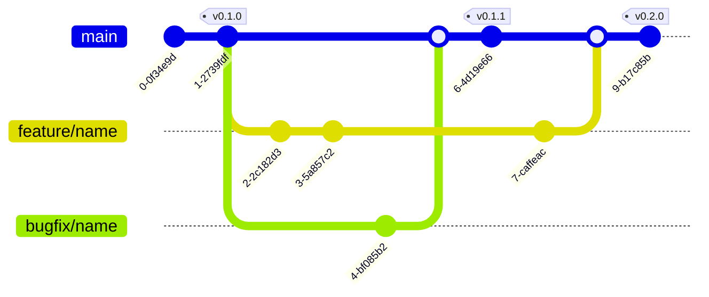

# osurs 

[](https://github.com/maptic/osurs/actions/workflows/cmake.yml)
[](https://github.com/maptic/osurs/actions/workflows/doxygen.yml)

Optimization of space utilization in reservation systems. An algorithm for optimal distribution of reservations along a trip among available seats.

The **osurs** library contains the following modules with corresponding headers:

- **io:** Input and output of networks and its structures.
- **network:** Network for reservation optimization.
- **reserve:** Connection routing, checking seat availability and reservation.
- **optimize:** Optimizing space utilization in reservation systems.
- **olal:** Optimization logic abstraction layer.
- **types:** Data types of osurs.

**Interdependencies:**


**Note:** The core functionality of **osurs** is optimizing reservations. There are already powerful routing algorithms for public transport, so the algorithm included here is minimal and only serves to book reservations on already known/found connections to the right segments of the trips (without transfers).

## Network structure

The network consists of nodes where vehicles stop and passengers can get on and off. A route stores the order in which the nodes are approached by a vehicle in a chain of stops. Each stop contains information about which stop is next and how long it takes to reach it. On routes, trips indicate the departure times at which a vehicle leaves from the route's root stop. Vehicle information such as capacity and reservations are stored at the trip level.

All objects of the network are located on the heap and are directly or indirectly linked to the network structure. If the memory of the network is released (`delete_network()`) all associated structures of the network are also cleared.


## Connections and reservations

Queried connections are not stored on the network and must be released individually to prevent a memory leak (`delete_connection()`). If more than one connection is possible between to nodes on the network, a connection chain is created. In a connection chain, the `.prev` property of the connection structure points to the previous connection or `NULL` if it is the root of the chain. Identically, the `.next` property points to the next connection or to `NULL` if it is the end of the chain.


When a reservation is made, it is stored as a reservation struct on the network with a relation to the corresponding trip. The reservation exists on the heap until the entire network is released.


## Import and export

Networks and reservations can be persisted as separate XML files. This separation brings the advantage that the reservations (e.g. of a certain day) can be added to an already loaded network. However, it is important to delete already existing reservations from the network beforehand.

```c
#include <osurs/io.h>

int main(int argc, char* argv[]) {
    Network* network = new_network();
    if (!import_network(network, "network.xml")) {
        perror("Could not load network.");
        return 1;
    }
    if (!import_reservations(network, "reservations.xml")) {
        perror("Could not load reservations.");
        return 1;
    }
    delete_network(network);
    return 0;
}
```

In addition, transit schedules and vehicle definition files from MATSim can be imported using `import_matsim()`.

## Development

### Trunk-based development workflow

The [trunk-based development workflow](https://trunkbaseddevelopment.com) uses one `main` branch to record the history of the project. In addition to the mainline, short-lived feature or bugfix branches are used to develop new features or fix bugs.



This library uses [semantic versioning](https://semver.org/spec/v2.0.0.html). Once `main` has acquired enough features for a release, set the new version number in the [`CMakeLists.txt`](CMakeLists.txt) and [`CHANGELOG.md`](CHANGELOG.md). Commit and push to `main` and publish a release on [GitHub](https://github.com/maptic/osurs/releases) with the version number as tag.

### Style guide

Use the following naming conventions:

- `snake_case` for variables and variables.
- `UpperCamelCase` for type definitions.
- `UPPER_SNAKE_CASE` for constants.

Place the opening brace on the same line in function definitions and flow control statements:

```c
int function(int x) {
    if (x > 0) {
        // ...
    }
    return x;
}
```

### Testing

Always write a unit test for new features using googletest and check for memory leaks before merging a feature into main:

```sh
valgrind -s --leak-check=full ./main
```

### Setup dependencies

The following dependencies must be installed on the system to build and test the project:

```txt
cmake       # Build, test and package
doxygen     # Render docs
graphviz    # Graphs in docs
googletest  # Unit tests, installed via cmake
valgrind    # Detect memory leaks
libxml2     # Read and write networks
```

- **Ubuntu**

```sh
apt install cmake doxygen graphviz valgrind libxml2-dev
```

- **macOS**

```sh
brew install cmake doxygen graphviz valgrind libxml2
```

## References

### Project setup

- [Calling Doxygen from cmake](https://p5r.uk/blog/2014/cmake-doxygen.html)
- [Canonical Project Structure](https://www.open-std.org/jtc1/sc22/wg21/docs/papers/2018/p1204r0.html)
- [Creating and running tests with CTest](https://coderefinery.github.io/cmake-workshop/testing/)
- [GoogleTest: Building with CMake](https://google.github.io/googletest/quickstart-cmake.html)
- [Import C headers in CPP](https://stackoverflow.com/questions/23646595/)
- [Integrating Google Test Into CMake Projects](https://matgomes.com/integrate-google-test-into-cmake/)
- [Keep a changelog](https://keepachangelog.com/en/1.0.0/)
- [Mermaid Cheat Sheet](https://jojozhuang.github.io/tutorial/mermaid-cheat-sheet/)
- [modern-cmake/examples/extended-project](https://gitlab.com/CLIUtils/modern-cmake/-/tree/master/examples/extended-project)

### Testing import and export module

- [cmake generate test data [duplicate]](https://stackoverflow.com/questions/42806857/cmake-generate-test-data)
- [MATSim pt test resources](https://github.com/matsim-org/matsim-libs/tree/master/matsim/src/test/resources/test/input/org/matsim/pt/counts)
- [Test reading from a file using GoogleTest](https://stackoverflow.com/questions/28616603/test-reading-from-a-file-using-googletest)
- [Copy file from source directory to binary directory using CMake](https://stackoverflow.com/questions/34799916/copy-file-from-source-directory-to-binary-directory-using-cmake)

### Routing

- [Dijkstra’s Algorithm in C](https://www.thecrazyprogrammer.com/2014/03/dijkstra-algorithm-for-finding-shortest-path-of-a-graph.html)

### IO

- [Parse and Print XML File in Tree Form using libxml2 in C](https://qnaplus.com/print-xml-file-tree-form-libxml2-c-programming/)
- [Libxml2: Everything You Need in an XML Library](https://www.developer.com/database/libxml2-everything-you-need-in-an-xml-library/)

### Python bindings

- [Python Bindings: Calling C or C++ From Python](https://realpython.com/python-bindings-overview/)

### Strings

- [C Strings](https://stackoverflow.com/questions/10162152/how-to-work-with-string-fields-in-a-c-struct)
- [Linked List](https://www.geeksforgeeks.org/linked-list-set-1-introduction/)
